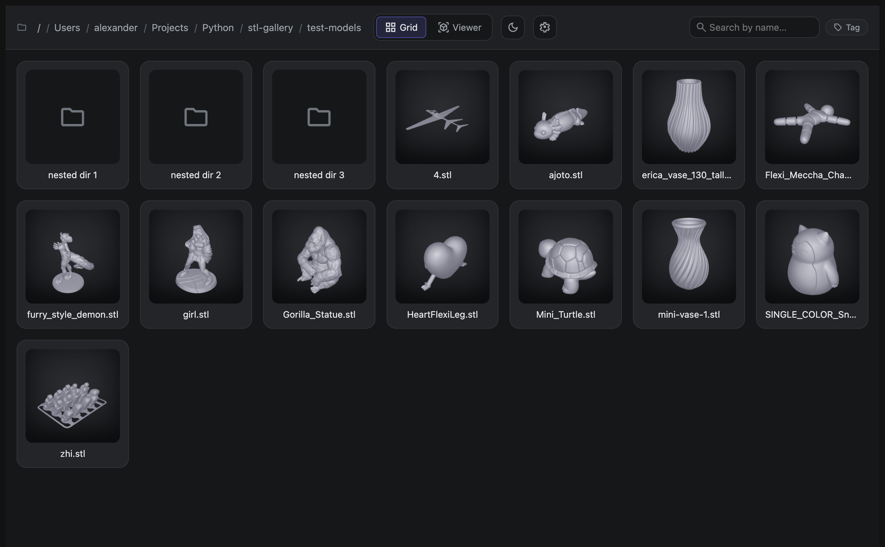
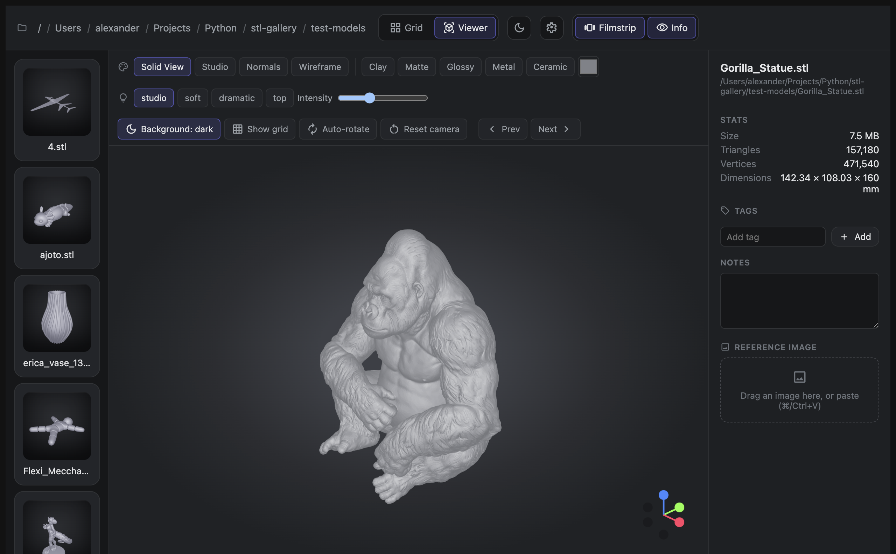
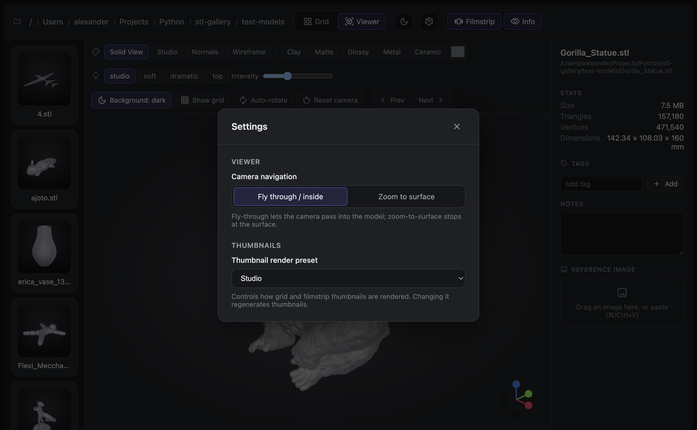

# STL Gallery

A fast, **offline** desktop gallery for STL 3D‑print files — browse a folder the
way an image viewer browses photos, then open any model in an interactive 3D
viewer to rotate, re‑light, and re‑material it. Add tags, notes, and a linked
reference image to keep a growing collection searchable. macOS and Windows from
one codebase.



## Features

- 📂 **Open a folder, see thumbnails.** STL files render to cached thumbnails
  that fill in progressively; subfolders appear as tiles with breadcrumb
  navigation.
- 🧊 **Interactive 3D viewer.** Orbit, pan, and zoom (Z‑up, 3D‑print
  convention), with a Blender‑style axis gizmo and Prev/Next navigation through
  the folder.
- 🎨 **Material presets.** *Solid View* (matte grey, the viewer default),
  *Studio* (studio‑clay, the thumbnail default), *Normals*, *Wireframe*, plus
  *Clay / Matte / Glossy / Metal / Ceramic* — with lighting presets, adjustable
  intensity, and a base‑color picker.
- 🏷️ **Portable metadata.** Per‑model **tags** and **notes**, plus a single
  **linked reference image** (drag‑drop or paste). Everything is stored in
  sidecar files *next to the model*, so it travels when you copy the folder.
- 🔎 **Search & filter.** Find by filename and filter by tags, optionally across
  subfolders.
- 📊 **Model info.** File size, triangle/vertex counts, and bounding‑box
  dimensions.
- ⚙️ **Settings.** Camera navigation mode (fly‑through vs. zoom‑to‑surface) and
  the thumbnail render preset.
- 🔗 **File association.** Can be set as the default app for `.stl` files —
  double‑click a model to open it straight in the viewer.
- 🌙 **Dark / light theme**, and a collapsible filmstrip and info panel for a
  focused, full‑bleed viewer.

Everything works on local files — **no network, no accounts, no cloud.**

## Screenshots

**3D viewer** — material & lighting presets, model info, tags/notes, linked
reference image, and the axis gizmo:



**Settings** — camera navigation mode and thumbnail render preset:



## Getting started

Requires [Node.js](https://nodejs.org/) 18+.

```bash
npm install
npm run dev
```

`npm run dev` launches the app (Electron + Vite) with hot reload.

### Build installers

```bash
npm run dist       # packaged installer for the current OS (.dmg / NSIS)
npm run dist:dir   # unpacked app directory (no installer)
```

Installers are produced **unsigned** (no code‑signing / notarization).

## How your data is stored

Metadata and thumbnails live in hidden sidecar folders **beside your models**,
so a collection is self‑contained and portable:

| Location | Contents |
|---|---|
| `.meta/<name>.stl.json`   | Tags and notes for a model |
| `.thumb/<name>.stl.*.png` | Cached thumbnail (keyed by render version + preset) |
| `.linked/<name>.stl.*`    | The model's linked reference image |

Copy a folder to another machine and the tags, notes, thumbnails, and reference
images come with it. Thumbnails regenerate automatically when the render preset
or renderer changes.

## Material presets

The viewer's picker is split into two groups: the everyday presets first, then
the rest.

| Preset | Look |
|---|---|
| **Solid View** | Neutral matte‑grey clay (Blender “solid mode”). *Default in the 3D viewer.* |
| **Studio** | Studio‑clay with soft front lighting. *Default for thumbnails.* |
| **Normals** | Surface‑normal debug shading |
| **Wireframe** | Edges only |
| Clay / Matte / Glossy / Metal | Lit materials that respond to the lighting preset and base color |
| Ceramic | Glazed‑porcelain matcap |

*Solid View*, *Studio*, and *Ceramic* are **matcap** materials — their look is
baked into a texture, so they render identically in a thumbnail and in the live
viewer regardless of the scene lighting.

## Tech stack

- **[Electron](https://www.electronjs.org/)** with a secure split (main +
  preload `contextBridge` + sandboxed renderer)
- **[React](https://react.dev/)** + **[TypeScript](https://www.typescriptlang.org/)**,
  built with **[electron‑vite](https://electron-vite.org/)**
- **[three.js](https://threejs.org/)** for the WebGL viewer and offscreen
  thumbnail rendering (off the main thread)
- **[Zustand](https://github.com/pmndrs/zustand)** for state
- **[Vitest](https://vitest.dev/)** + Testing Library for unit tests, and
  **[Playwright](https://playwright.dev/)** (Electron) for end‑to‑end tests that
  render real WebGL

## Development

```bash
npm test          # unit tests (Vitest)
npm run typecheck # TypeScript, no emit
npm run e2e       # Playwright‑Electron end‑to‑end tests
```

Design docs live in [`wiki/`](wiki/_INDEX.md) — overview, UX & layout,
architecture, data formats, the viewer, performance, tech stack, and testing.

## Scope

STL only (no OBJ/3MF/STEP), no mesh editing or repair, and no persistent
multi‑root library — the app opens one folder at a time. See
[`wiki/01-overview.md`](wiki/01-overview.md) for the full in/out‑of‑scope list.
